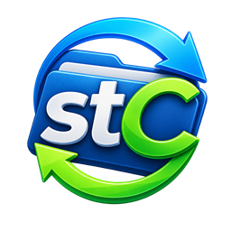
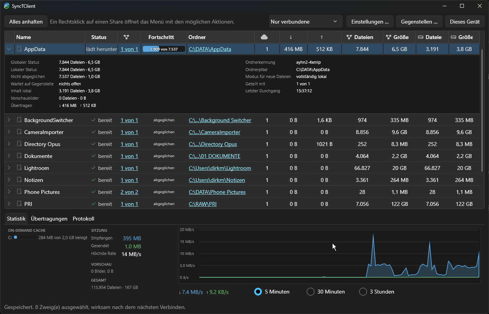
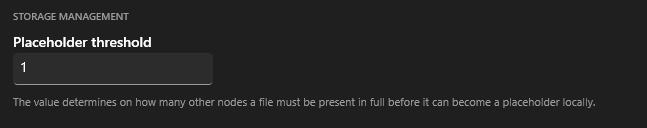
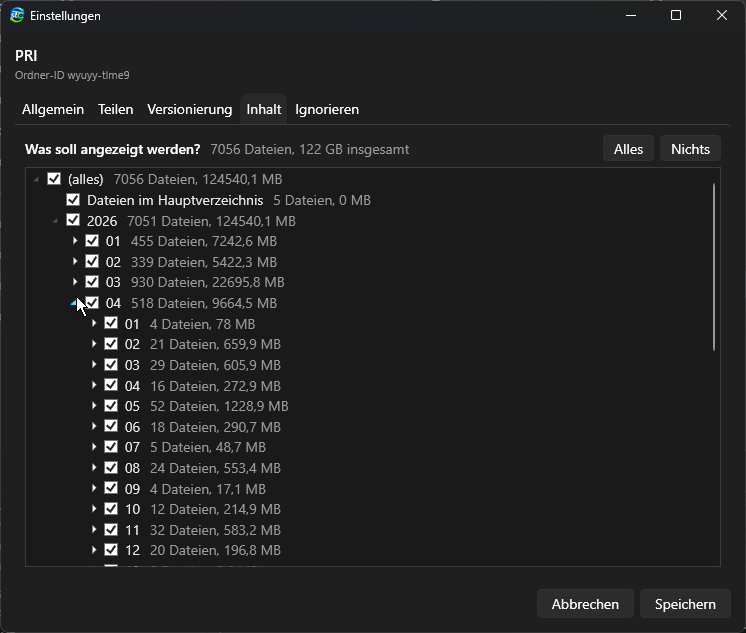
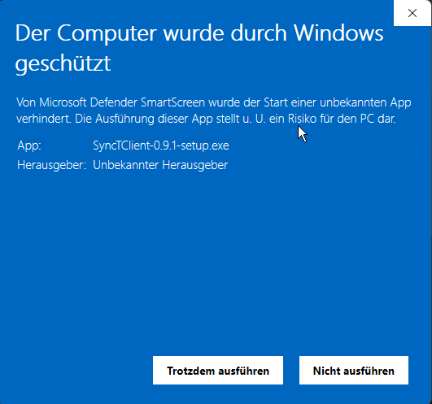

[English](README.md) · **Deutsch**



# SyncTClient

Ein Syncthing-Client für Windows, der Dateien als **Platzhalter** darstellt und
Inhalte erst bei Zugriff überträgt — mit selbstverwaltetem Cache je Datenträger.

Die Dateien bleiben dabei gewöhnliche Dateien im Dateisystem. Kein Container,
kein virtuelles Laufwerk, kein eigenes Format: was der Client einbindet, kann
jedes andere Programm gleichzeitig lesen.

> [!CAUTION]
> ## Keinerlei Haftung. Keinerlei Gewährleistung. Nutzung auf eigene Gefahr.
>
> **Diese Software überträgt, ersetzt, verdrängt und löscht Dateien.** Sie
> ändert Einstellungen des Betriebssystems, meldet Synchronisationswurzeln an
> und greift in den Dateimanager ein.
>
> **Der Autor haftet unter keinen Umständen und aus keinem Rechtsgrund für
> Schäden irgendwelcher Art**, die aus der Installation, der Nutzung, der
> Fehlfunktion oder der Nichtnutzbarkeit dieser Software entstehen oder mit ihr
> in Zusammenhang stehen — einschließlich Verlust, Löschung, Überschreibung
> oder Beschädigung von Daten auf diesem Rechner und auf jedem anderen Gerät,
> das mit ihm Daten austauscht, Datenabfluss an Gegenstellen, Rückständen im
> System, entgangenem Gewinn, Betriebsunterbrechung und Kosten der
> Wiederbeschaffung von Daten. Das gilt auch dann, wenn auf die Möglichkeit
> solcher Schäden hingewiesen wurde. **Jegliche Schadensersatzansprüche werden
> hiermit ausdrücklich abgelehnt.**
>
> **Die volle Verantwortung trägt allein der Nutzer.** Sie allein entscheiden,
> ob und wofür Sie diese Software einsetzen, und Sie allein tragen die Folgen.
> **Setzen Sie sie niemals ohne eine unabhängige, geprüfte Sicherung ein, und
> niemals als einzige Ablage von Daten, deren Verlust Sie nicht hinnehmen
> können.**
>
> Vollständiger Text: [Nutzungsbedingungen](setup/EULA.de.txt) — der Installer
> zeigt sie als Seite, die vor der Installation bestätigt werden muss.



*Freigaben mit Zustand, Fortschritt, Rückstand und Durchsatz. Die aufgeklappte
Freigabe zeigt, was die Gegenstellen führen, was hier lokal liegt und was
bisher über die Leitung ging.*

## Warum

Kein existierender Sync-Dienst kann alle vier Dinge gleichzeitig:

| | |
|---|---|
| a) Platzhalter wie OneDrive | Nextcloud, Seafile ✓ · Syncthing ✗ |
| b) selbstverwalteter Cache mit Größenlimit | Seafile, rclone ✓ · Nextcloud ✗ |
| c) Client-zu-Client im selben Netz | Syncthing, Resilio ✓ · Nextcloud ✗ |
| d) bestehende Verzeichnisse einbinden | Syncthing, Resilio ✓ · Seafile ✗ |

Syncthing kann (c) und (d) von Haus aus. Dieses Projekt ergänzt (a) und (b) —
als eigenständiger Knoten, der das Block Exchange Protocol spricht. Auf der
Gegenseite steht ein unverändertes Syncthing.

## Dass das geht, ist kein Wunschdenken

Syncthings globaler Index enthält für **jede** Datei eines Ordners den Namen,
die Größe und die vollständige Blockliste — auch für Dateien, die lokal nicht
materialisiert sind. Und BEP hat eine `Request`-Nachricht mit *(Ordner, Name,
Offset, Größe, Hash)*: wahlfreier Blockzugriff über Netzwerk.

Damit ist der Katalog für die Platzhalter schon da, und das Bereitstellen eines
Inhalts ist ein gezielter Block-Request statt eines vollständigen Pulls.

### Ehrliche Ankündigung ist eingebaut

`FileInfo.setLocalFlags()` in Syncthing ruft `setNoContent()` auf, was
Blockliste und Größe verwirft. Ein Gerät kündigt also automatisch nur an, was
es wirklich hält — Gegenstellen fragen uns nie nach Daten, die wir nicht haben.
Das gilt es nicht zu umgehen, sondern zu nutzen.

## Was der Client kann

### Platzhalter

- Platzhalter im Explorer über die Cloud Filter API; der Inhalt wird
  übertragen, wenn jemand die Datei öffnet
- Überlagerungssymbole — Wolke, Kringel, grüner Haken — über den Anheft-Zustand
- **Ein Modus je Datei und je Ordner**, im Index geführt: *Platzhalter* oder
  *immer lokal*. Ein Ordner vererbt seinen Modus nach unten und überstimmt
  dabei die Vermerke darunter
- Cache mit Limit **je Datenträger**, Verdrängung nach letztem Zugriff,
  Invalidierung bei Änderung
- Verdrängung nur gegen Beweis: eine Kopie wird erst freigegeben, wenn die
  Gegenstelle sie im Index vollständig führt (`Size > 0` und Blockliste). Die
  geforderte Anzahl Gegenstellen ist je Freigabe einstellbar
- Lokal geänderte Dateien werden nicht verdrängt
- Der stündliche Durchgang gleicht die Anheft-Merkmale im Dateisystem mit der
  Datenbank ab — was im Dateimanager umgestellt wurde, gilt danach auch hier

#### Wann eine Datei ein Platzhalter werden darf



Den Inhalt einer Datei zu verwerfen ist der eine Vorgang hier, bei dem Daten
verloren gehen können — deshalb ist er der am stärksten abgesicherte. Inhalt
wird nie verworfen, weil ein Cache voll ist. Er wird verworfen, wenn die Datei
*nachweislich* wiederbeschaffbar ist.

Die Schwelle nennt die Zahl: wie viele andere Knoten die Datei **vollständig**
führen müssen, bevor ihre Bytes hier weichen dürfen. Die Vorgabe 1 ist der
Normalfall gegen einen einzelnen Server. Wer seine Dateien nicht von einem
einzigen anderen Gerät abhängig machen will, setzt 2. Kleiner als 1 ist nicht
zulässig — die letzte Kopie im Netz darf nicht verschwinden können.

Gezählt wird streng. Eine Gegenstelle, die die Datei nur *kennt*, zählt nicht:
ihr Indexeintrag muss eine Blockliste tragen und eine Größe über null. Syncthing
kündigt ohne Blockliste an, sobald es den Inhalt nicht hält — die ehrliche
Zählung fällt also aus dem Protokoll selbst heraus.

Und die Schwelle ist eine notwendige Bedingung, keine hinreichende. Alles davon
muss zutreffen, bevor ein einziges Byte weicht:

| Bedingung | Warum |
|---|---|
| genug Gegenstellen führen sie vollständig | die Schwelle selbst |
| sie führen **diese** Fassung | verglichen wird der Versionsvektor, nicht der Zeitstempel. Ein Zeitstempel sagt, welche Änderung später geschah, nicht ob eine Seite die andere kannte. Ohne diese Prüfung fordert der Platzhalter beim nächsten Zugriff die ältere Fassung an — unbemerkt, denn was zurückbleibt, ist eine gültige Datei, nur mit dem falschen Inhalt |
| die Ankündigung passt zu diesem Inhalt | der Name allein beweist nichts. Drüben kann sehr wohl eine andere Datei desselben Namens liegen, und dafür würde eine lokale Änderung gelöscht, die noch niemand gesehen hat |
| die Blöcke stimmen | gerechnet, nicht angenommen |
| die Ankündigung ist alt genug | BEP sagt dem Sender nie, dass der Empfänger fertig ist. Schlimmer: die Gegenstelle spiegelt unsere eigene Ankündigung samt Blockliste zurück, lange bevor sie ein Byte geholt hat. Wer das für einen Besitznachweis hält, löscht die Datei, bevor sie irgendwo ankommt — also wird gewartet |
| die Datei ist nicht angeheftet und nicht *immer lokal* | eine ausdrückliche Ansage wiegt schwerer als ein Limit |
| die Datei ist weder offen noch lokal geändert | Windows lehnt es ohnehin ab; die Prüfung macht die Änderung sichtbar, statt sie stumm scheitern zu lassen |

Das gilt auf jedem Weg, der Inhalt verwirft: im Kontextmenü, im Baum des
Datenträgers, bei der selbsttätigen Verdrängung am Limit und beim Knopf, der den
Cache leert. *Speicherplatz freigeben* ist eine Bitte, keine Vollmacht. Weichen
muss am Limit zuerst, was am längsten niemand angefasst hat.

Eine Ausnahme gilt leeren Dateien: eine Datei mit null Bytes erreicht die
Schwelle nie, weil die Zählung Blöcke verlangt und sie keine hat. Freigegeben
wird sie, wenn sie hier leer ist **und** bei der Gegenstelle — und darüber
entscheidet die eigene Größe, nicht die angekündigte, denn die Gegenstelle meldet
null auch für eine große Datei, die sie bloß kennt.

### Übertragung

- BEP in C#: Rahmung, Hello, Geräte-ID, Index, blockweiser Abruf, LZ4
- Eigene TLS-Schicht, weil Windows Ed25519 nicht beherrscht
- **Beide Richtungen.** Der Client nimmt Freigaben an *und* bietet eigene
  Ordner an: Index und IndexUpdate gehen hinaus, eingehende Verbindungen
  werden angenommen
- Erkennung im eigenen Netz und über Erkennungsserver; Gegenstellen mit
  dynamischer Adresse werden gefunden
- Eine Verbindung je Gegenstelle, die alle ihre Ordner trägt; getrennte
  Gegenstellen werden von selbst wieder aufgenommen
- Index in SQLite mit Wiederaufnahme: beim Neustart kommen nur Änderungen
- Konflikte nach Syncthings Muster, mit Gerätenamen statt Kurzkennung:
  `name.sync-conflict-JJJJMMTT-HHMMSS-GERÄT.endung`
- Ersetzte und gelöschte Fassungen unter `.stversions`, Aufbewahrung
  einstellbar; wahlweise über den Papierkorb
- Ausschlussmuster je Freigabe

### Im Dateimanager

Eine Shell-Erweiterung, nativ gebaut, trägt sich unter `HKEY_CURRENT_USER` ein
— ohne Administratorrechte:

| Eintrag | Wirkung |
|---|---|
| Immer auf diesem Gerät behalten | Modus *immer lokal*, Inhalt wird übertragen |
| Speicherplatz freigeben | Inhalt verwerfen, Platzhalter bleibt |
| Diesen Ordner ausblenden | Zweig aus dem Abgleich nehmen |
| Als Freigabe anbieten … | aus einem beliebigen Ordner eine Freigabe machen |

Die Einträge zeigen an, was gerade gilt, und gelten für eine Mehrfachauswahl.

Dazu Vorschaubilder auf Zuruf statt auf Vorrat: fragt der Dateimanager nach
einem Bild, überträgt der Client dessen Kopf — einen Block von 128 KiB — und
schneidet die eingebettete EXIF-Vorschau heraus. Gemessen: 42 ms im Median für
ein neues Bild, 2 ms für ein bekanntes. Der Platzhalter bleibt dabei stehen.

### Oberfläche

- Freigaben verwalten, angebotene Ordner übernehmen, Bindungen lösen,
  Teilbaum-Auswahl, Ansichtsfilter
- Platzhalter-Verwaltung je Datenträger als Baum, über alle Freigaben hinweg
- Übertragungen mit Fortschritt, Durchsatzdiagramm, Rückstand in beide
  Richtungen
- Protokollfenster, Symbol im Infobereich mit Zustandsplakette
- Deutsch und Englisch, helles und dunkles Thema
- Tagessicherung der Konfiguration samt Gerätezertifikat
- Auf Wunsch ein Blick nach einer neueren Fassung — nie, bei jedem Start, wöchentlich
  oder monatlich. Abgefragt wird nur, welche Freigabe auf GitHub die neueste ist:
  heruntergeladen wird nichts, die Abfrage geht ohne Anmeldung hinaus und
  trägt nichts über den Rechner mit sich. Ein Hinweis über der Werkzeugleiste
  verweist auf die Downloadseite



*Teilbaum-Auswahl: welche Zweige auf diesem Gerät liegen sollen. Jeder Knoten
nennt Anzahl und Größe, damit die Wahl an Zahlen hängt und nicht am Gefühl.*

## Installation

Fertiges Paket unter [Releases](https://github.com/Taloan/SyncTClient/releases/latest).

Voraussetzung ist Windows 10 Version 2004 (Build 19041) oder neuer, 64 Bit.
**Administratorrechte werden nicht gebraucht.** Die Einbindung in den Explorer
trägt das Programm beim ersten Start selbst ein, unter `HKEY_CURRENT_USER`, und
nimmt sie auf Wunsch wieder zurück.

### SmartScreen meldet sich



Beim Start des Installers meldet sich Microsoft Defender SmartScreen mit „Der
Computer wurde durch Windows geschützt" und nennt als Herausgeber „Unbekannter
Herausgeber". Das hat zwei Gründe, und keiner davon ist ein Fund:

- **Es gibt kein Signaturzertifikat.** Ein Zertifikat, dem Windows vertraut,
  kostet jedes Jahr Geld. Für ein Programm, das ich allein und ohne Einnahmen
  entwickle, ist das nicht drin.
- **SyncTClient ist neu.** SmartScreen urteilt zusätzlich nach Bekanntheit: was
  selten heruntergeladen wurde, kennt es nicht und warnt vorsichtshalber. Das
  legt sich mit der Zahl der Installationen, kann aber dauern.

Zum Fortfahren: **Weitere Informationen**, dann **Trotzdem ausführen**.

Wer sichergehen will, dass die Datei die ist, die hier veröffentlicht wurde,
vergleicht ihre Prüfsumme mit der, die bei der
[Freigabe](https://github.com/Taloan/SyncTClient/releases/latest) steht:

```powershell
Get-FileHash .\SyncTClient-0.9.1-setup.exe -Algorithm SHA256
```

Stimmen die beiden überein, ist unterwegs nichts verändert worden. Wer die Datei
gebaut hat, belegt das nicht — das könnte nur eine Signatur.

## Aufbau

```
src/SyncTClient.Bep/               Protokollbibliothek, plattformunabhängig
  Protos/bep.proto                 aus syncthing/proto/bep/bep.proto
  DeviceId.cs                      Base32 + Syncthings Prüfziffernverfahren
  DeviceIdentity.cs                Gerätezertifikat; ID = SHA-256 des DER
  BepFraming.cs                    Draht-Rahmung + LZ4-Blockformat
  BepTls.cs                        TLS, weil Windows Ed25519 nicht kann
  HelloExchange.cs                 Vor-Authentifizierungs-Handshake
  BepConnection.cs / BepListener   Leseschleife, Request/Response, eingehend
  LocalDiscovery / GlobalDiscovery Erkennung im Netz
  FolderIndex / PersistentFolderIndex   Index im Speicher und in SQLite
  FileFetcher.cs                   blockweises Übertragen mit Hash-Prüfung

src/SyncTClient.Vfs/               Cloud Filter API
  WinRtSyncRoot.cs                 Anmeldung der Wurzel, Hydrations-Politik
  CloudFilterMount.cs              Rückrufe des Dateisystems
  HydrationCache / CacheLimits     Buchführung und Verdrängung je Datenträger

src/SyncTClient.Mount/             der Client: Freigaben, Abgleich, Befehle
src/SyncTClient.Gui/               WPF-Oberfläche
src/SyncTClient.ExplorerProvider/  Shell-Erweiterung, NativeAOT
src/SyncTClient.ThumbHost/         Wirt für die Vorschau-Anbieter
src/SyncTClient.Probe/             Konsolenwerkzeug zum Nachweis

setup/SyncTClient.iss              Inno-Setup-Skript
tools/Veroeffentlichen.ps1         Installer bauen und Freigabe anlegen
```

## Aus dem Quelltext bauen

Gebraucht werden das .NET-10-SDK und die Arbeitslast „Desktopentwicklung mit
C++" für den NativeAOT-Teil.

```
dotnet build SyncTClient.slnx -c Release
```

Läuft nur als `win-x64`; ein anderer RuntimeIdentifier bricht mit einer
Meldung ab. Veröffentlicht wird über das Profil `FolderProfile` nach `BIN`,
danach macht `tools\Veroeffentlichen.cmd` daraus den Installer und die Freigabe.

Das Konsolenwerkzeug zeigt den Index einer Gegenstelle an, **ohne etwas auf die
Platte zu schreiben**:

```
dotnet run --project src/SyncTClient.Probe -- --id
dotnet run --project src/SyncTClient.Probe -- --addr 192.168.1.42:22000 --target <GEGENSTELLE> --folder <ORDNER>
```

## Stand

Fassung 0.9.1. Der Client läuft im täglichen Betrieb gegen Syncthing v2.
Jede Änderung steht im [Changelog](CHANGELOG.md).

Offen ist die Zusammenlegung der beiden Wege, auf denen ein Inhalt für „immer
lokal" hereinkommt: das Anheften stößt die Bereitstellung durch Windows an,
während der Durchgang im Hintergrund dieselbe Datei über eine Nebendatei holt.
Treffen beide zusammen, meldet Windows eine Sperre auf der Datei.

## Mitwirken

Dieses Verzeichnis ist für alle außer seinem Autor nur lesbar. Der Quelltext
darf heruntergeladen, gelesen und benutzt werden; Fehlermeldungen über Issues
sind willkommen. Für Änderungen gibt es eine einzige Quelle, und das ist so
gewollt.

## Haftung

Keine. Siehe den Hinweis am Anfang dieser Seite und die vollständigen
[Nutzungsbedingungen](setup/EULA.de.txt). Der Installer zeigt sie als Seite, die
bestätigt werden muss, bevor irgendetwas auf die Platte geschrieben wird.

## Lizenz

Apache 2.0 — siehe [LICENSE](LICENSE).
